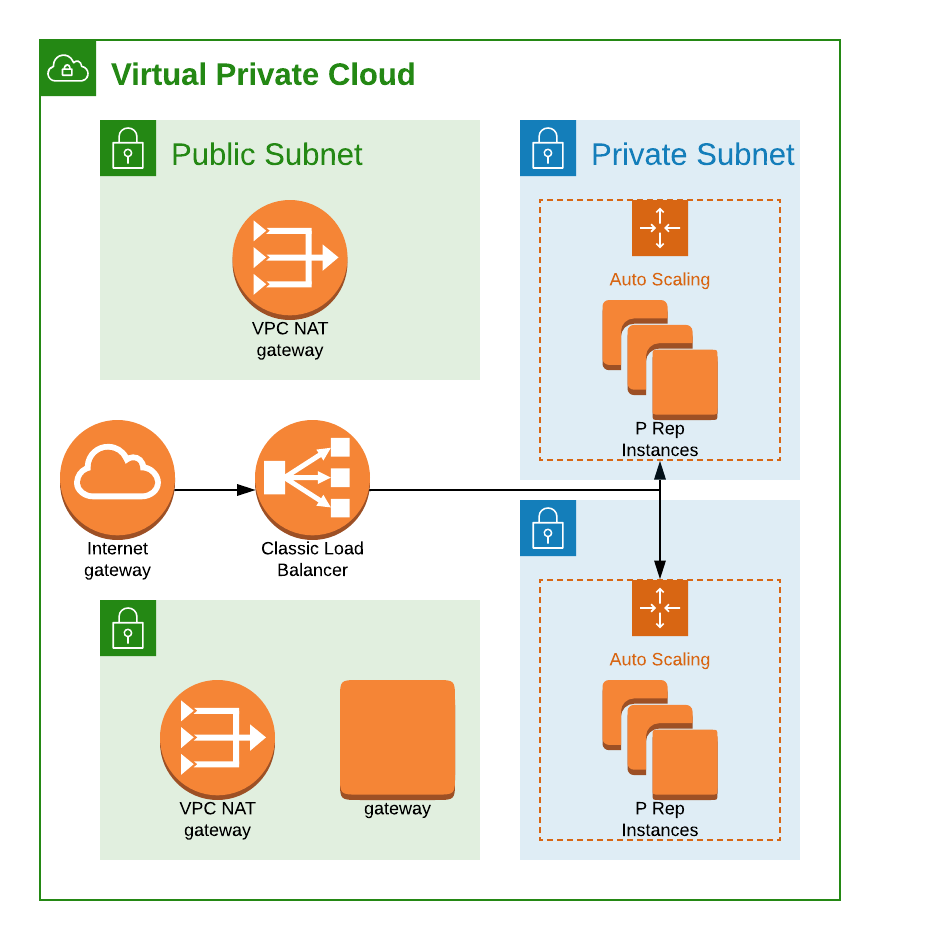

# ICON P-Rep Node 

## Pre-Deployment Check List 

- Initialize account
- Setup local environment 
- Deploy infrastructure 


### Initialize account

- Basically follow [this guide.](https://docs.cloudposse.com/reference-architectures/cold-start/)
    - You only need to have admin privileges once as we initialize the account.  
    - Afterwards we revoke the role used to deploy all the resources and setup roles that we will use later to update 
    the resources.

### Setup local environment 

- Install terraform version 0.11.14 (version needs to exceed the one used to create state) and put in path 
    - Can be done through brew or from GH releases 
    - This is only because terragrunt currently does not support 0.12.x

```bash
wget https://releases.hashicorp.com/terraform/0.11.14/terraform_0.11.14_linux_amd64.zip
unzip terraform_0.11.14_linux_amd64.zip
sudo chmod +x terraform 
sudo mv terraform /usr/local/bin/terraform11
sudo ln -s /usr/local/bin/terraform11 /usr/local/bin/terraform
terraform --version 
```
    
- Install terragrunt 
    - Same as above but use latest version 
- Get AWS Credentials 
    - export the appropriate AWS_SECRET_ACCESS_KEY environment variables for the account you are trying to deploy to
    - aws-vault is a nice tool to have here as demonstrated in manual deployment options 

### Deploy infrastructure 

Deploy all the infrastructure 
```bash
./deploy.sh 
```

```bash
aws-vault exec hc-root-admin -- terragrunt force-unlock -force <lock number>
aws-vault exec hc-root-admin -- terragrunt destroy --terragrunt-source-update
```

## Infrastructure 



### VPC 

- One vpc per region 
- Specify number of availability zones and private and public subnets deployed in each AZ
- Specify the CIDR blocks to be used.  Needs to correspond to each AZ
    - TODO: Make CIDR block calculations dynamic through CIDR calculator and discuss with ICON about standard route tables 
    
**Example CIDR Blocks:**

| Subnet          | CIDR        |
|-----------------|-------------|
| public subnet 1 | 10.0.1.0/24 |
| public subnet 2 | 10.0.1.0/24 |
| public subnet 3 | 10.0.1.0/24 |
| private subnet 1 | 10.1.1.0/24 |
| private subnet 2 | 10.1.2.0/24 |
| private subnet 3 | 10.1.3.0/24 |


### Security Groups 

- Each service has it's own security group and associated policies to support communications over the ports 

TODO: Finalize SGs and rules 

### P-Rep Node 

Lots of ways to run application. To understancd more about the different options and the thought process behind choices, please review [these docs](docs/icon-planning.md).  Currently this architecture is focussed on an MVP which will leverage a user-data script to bootstrap the p-rep node on startup.  Over time, a move towards running on ECS could be considered.  For now, the advantages of using kubernetes have been loosely ruled out though that might change. 

- 

### IAM Roles 

Several roles that can be assumed or given to users or groups within and across accounts. 

- read
- write 
- destroy 
- audit - TODO

